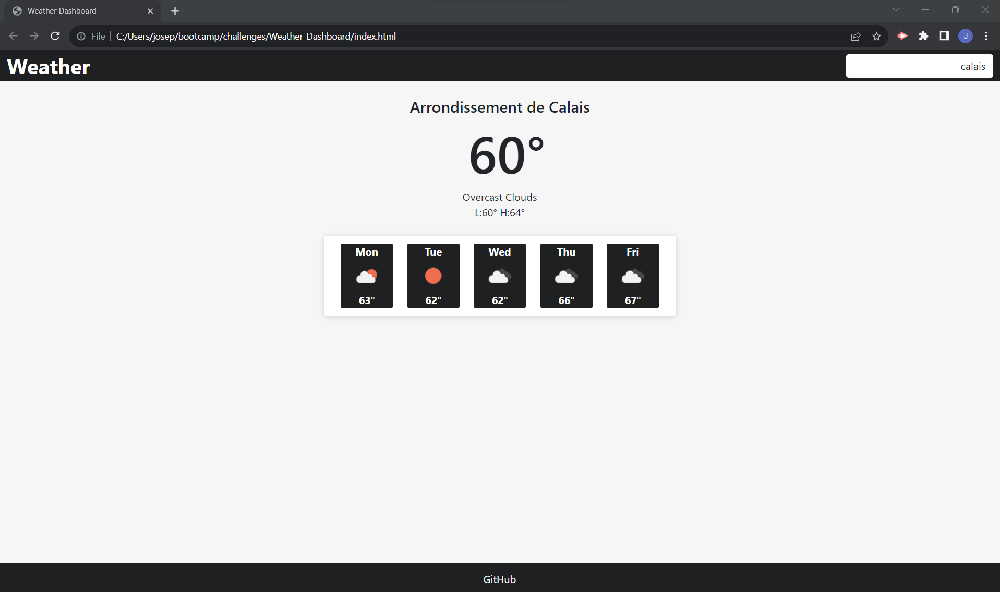

# Weather Dashboard

## Description

- When the user loads the page, then they can search for current and forecasted weather based on city.
- When the city is searched, then the Open Weather API fetches the corresponding weather data.
- When the weather data is fetched, then the data is used to populate and display the current and forecasted weather.

## Link to Site
https://joseph-s-foster.github.io/Weather-Dashboard/

## Screenshot
